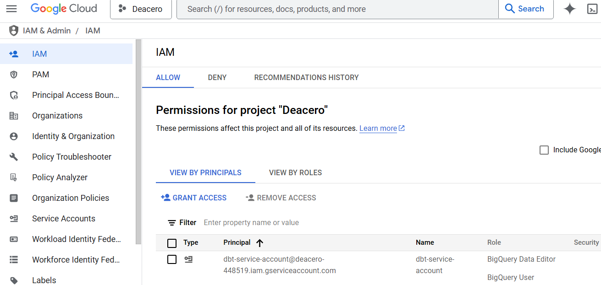
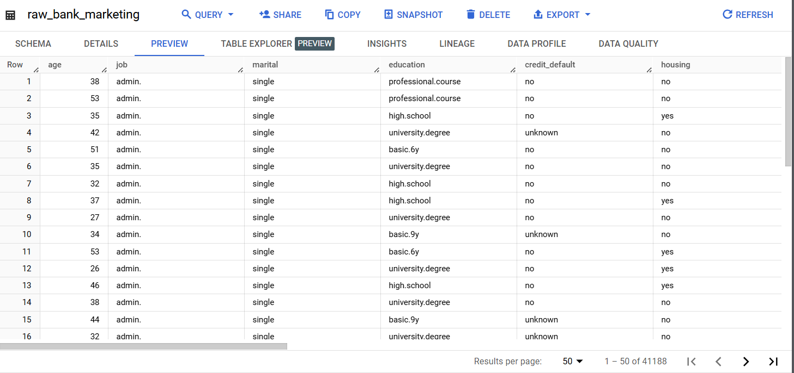
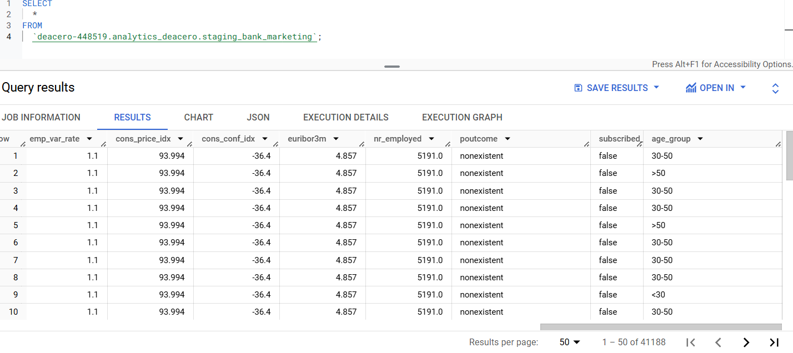
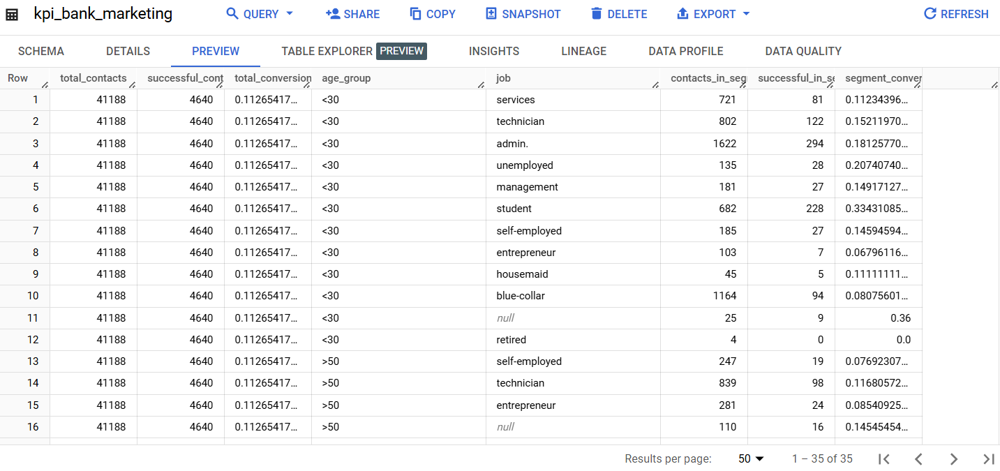

# Proyecto DBT - Bank Marketing

Este proyecto demuestra un flujo de trabajo completo de **Data Engineering** con dbt y BigQuery, incluyendo:

- Creación de **Service Account** en GCP
- Configuración de **BigQuery** (Dataset y tabla `raw_bank_marketing`)
- Entorno local con **Python** y **dbt**
- **Modelos** (Staging y KPI)
- **Pruebas** de calidad de datos (Data Test y Unit Test)
- **Pipeline CI/CD** en GitHub Actions
- Manejo de **variables de entorno** y **secrets**

---

## Índice

1. [Estructura del Repositorio](#1-estructura-del-repositorio)  
2. [Requisitos Previos](#2-requisitos-previos)  
3. [Creación de Service Account en GCP](#3-creación-de-service-account-en-gcp)  
4. [Preparación de Datos en BigQuery](#4-preparación-de-datos-en-bigquery)  
5. [Estructura Inicial del Proyecto dbt](#5-estructura-inicial-del-proyecto-dbt)  
6. [Modelos Principales: Staging y KPIs](#6-modelos-principales-staging-y-kpis)  
7. [Pruebas y Calidad de Datos](#7-pruebas-y-calidad-de-datos)  
8. [Configuración de CI/CD en GitHub Actions](#8-configuración-de-ci-cd-en-github-actions)  
9. [Cómo Ejecutar el Proyecto](#9-cómo-ejecutar-el-proyecto)

---

## 1. Estructura del Repositorio

El repositorio incluye los siguientes componentes:

- **`dbt_project.yml`**: Configuración principal de dbt (nombre de proyecto, paths, etc.).
- **`profiles.yml`** : Configuración de credenciales para BigQuery.
- **Carpeta `models/`**: 
  - `staging_bank_marketing.sql` (limpieza y normalización de datos).
  - `kpi_bank_marketing.sql` (cálculo de KPIs y agregaciones).
  - `schema.yml` (data tests por modelo)
- **Carpeta `tests/`** (unit tests):
  - Archivos `.yml` con unit tests
- **Carpeta `.github/workflows/`**:
  - `dbt_monitoring.yml`: Programación diaria (o periódica) para ejecutar pruebas.
  - `deploy_to_main.yml`: Despliegue al hacer *push* en `main`.
  - `pr_to_main.yml`: Validación (parse & test) en *pull requests*.
- **`.env.example`** y (opcionalmente) `.env` (ignorada en `.gitignore`).
- **`requirements.txt`**: requerimentos del proyecto

---

## 2. Requisitos Previos

1. **Cuenta de Google Cloud** con acceso a BigQuery.
2. **Service Account** con permisos de lectura/escritura en BigQuery.
3. **Archivo JSON** de credenciales (clave privada) para la cuenta de servicio.
4. **Python 3.7+** instalado en tu máquina local.
5. **Git** para clonar o trabajar con el repositorio.

---

## 3. Creación de Service Account en GCP

- Desde la consola de Google Cloud, en la sección **IAM & Admin → Service Accounts**, se generó una cuenta de servicio (`BigQuery Admin`) y se descargó el archivo JSON de credenciales.
- Dicha clave se mantuvo fuera del repositorio para evitar exponer credenciales.



---

## 4. Preparación de Datos en BigQuery

- Se creó un **dataset** denominado `analytics_deacero` en BigQuery para alojar las tablas del proyecto.
- Se cargaron los datos del [Bank Marketing Dataset](https://archive.ics.uci.edu/dataset/222/bank+marketing) en la tabla `raw_bank_marketing` con una pequeña modificacion en los headers para intercambiar los simbolos **.** por **_**. Se hizo manualmente, usando la consola de BigQuery (opción *Create table* → *Upload CSV*) y marcando la opcion de delimitador custom **;** por el formato del archivo.



---

## 5. Estructura Inicial del Proyecto dbt

- Se generó un archivo `dbt_project.yml`, estableciendo la carpeta de modelos y configuraciones básicas.
- El archivo `profiles.yml` se configuró para BigQuery usando `method: service-account`, y se decidió emplear variables de entorno (`env_var`) en lugar de credenciales en texto plano.
- Para facilitar la colaboración, se creó un `.env.example` con placeholders de las variables requeridas (`DBT_GOOGLE_PROJECT`, `DBT_GOOGLE_BIGQUERY_DATASET`, etc.), mientras que `.env` con valores reales se añadió a `.gitignore`.

---

## 6. Modelos Principales: Staging y KPIs

1. **Staging** (`staging_bank_marketing.sql`):  
   - **Objetivo**: limpiar y normalizar datos.  
   - Se asignaron categorías en `age_group` (`<30`, `30-50`, `>50`) basado en `age`.  
   - Se reemplazaron valores `'unknown'` por `NULL` en columnas como `job`, `marital`, etc usando **CASE**.
   - Se cambiaron los nombres de algunas columnas como `y` por `subscribed_deposit` para que fueran mas descriptivas.
   - Se utilizaron las funciones **LOWER** y **TRIM** en todos los campos de texto para su normalizacion.
   - Consolidación de niveles educativos como 'basic' para valores como 'basic.4y', 'basic.6y' y 'basic.9y'.

   


2. **KPIs** (`kpi_bank_marketing.sql`):  
   - **Objetivo**: generar métricas de marketing (tasa de conversión, contactos exitosos, segmentaciones).
   - Mediante una sentencia **CASE** en conjunto de un **SUM** se contabilizaron los successful_contacts.
   - Se realizaron agregaciones globales mediante la division de los successful_contacts entre los totales. 
   - Se realizó un `JOIN` de agregaciones globales con el detalle de segmentación por `job` y `age_group`.  
   - Se materializó como `table` para mejorar la consulta posterior.

   

---

## 7. Pruebas y Calidad de Datos

  - Se crearon archivos `schema.yml` asociados a cada modelo para data tests
  - `not_null` en columnas críticas (e.g. `age`, `subscribed_deposit`).  
  - `accepted_values` para columnas con dominios fijos (`job`, `month`, etc.).
  - Se crearon los archivos `kpi_bank_marketing_test` y `staging_bank_marketing_test` para el unit testing

---

## 8. Configuración de CI/CD en GitHub Actions

- Se optó por GitHub Actions para automatizar validaciones y despliegues. Se crearon tres *workflows*:

  1. **`dbt_monitoring.yml`**: ejecuta pruebas (`dbt test`) en horario programado, detectando anomalías de calidad.
  2. **`deploy_to_main.yml`**: en cada *push* a `main`, hace `dbt parse`, `dbt test` y `dbt run` para desplegar cambios.  
  3. **`pr_to_main.yml`**: en *pull requests*, se limita a `dbt parse` y `dbt test`, sin hacer run (evitando cambios en producción).  
- Para manejar credenciales, se definieron *secrets* en el repositorio (ej. `DBT_GOOGLE_BIGQUERY_KEYFILE`)

---

## 9. Cómo Ejecutar el Proyecto

Esta sección describe brevemente el proceso para **ejecutar** el proyecto en diferentes entornos.

### 9.1 Ejecución Local

1. **Clonar el repositorio** y ubicarse en la carpeta raíz.  
2. **Crear un entorno virtual** (opcional pero recomendado):
  ```bash
  python3 -m venv venv
  source venv/bin/activate
  ```
3. **Instalar dependencias**:
  ```bash
  pip install -r requirements.txt
  ```
  
4.  **Configurar variables de entorno**:
  - Copiar el archivo .env.example a .env y rellenar con valores reales (ruta al keyfile, nombre de proyecto GCP, etc.).
  - Cargar el archivo .env:

  ```bash
  source .env
  ```
5.  **Validar y ejecutar dbt**:
  ```bash
  dbt debug   # Verifica la conexión
  dbt test    # Lanza las pruebas definidas en schema.yml
  dbt run     # Construye/actualiza los modelos en BigQuery
  ```
### 9.2 Ejecución en GitHub Actions

Cualquier pull request que se dirija a main desencadenará el workflow pr_to_main.yml, haciendo validaciones (dbt parse) y pruebas (dbt test).
Un push a la rama main activará deploy_to_main.yml, el cual despliega cambios (dbt run) si las pruebas pasan.
El workflow dbt_monitoring.yml se ejecuta en un horario predefinido para lanzar dbt test de forma periódica, notificando fallos.
De esta forma, los modelos se mantienen en producción y se auditan continuamente sin intervención manual.